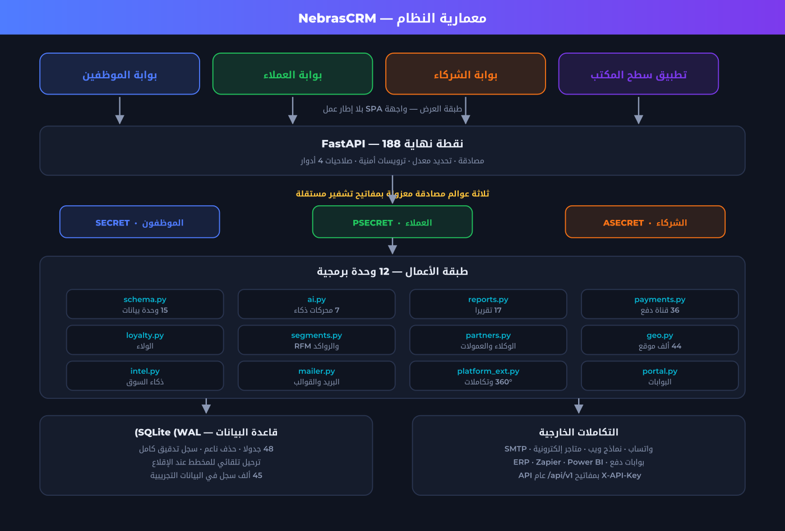
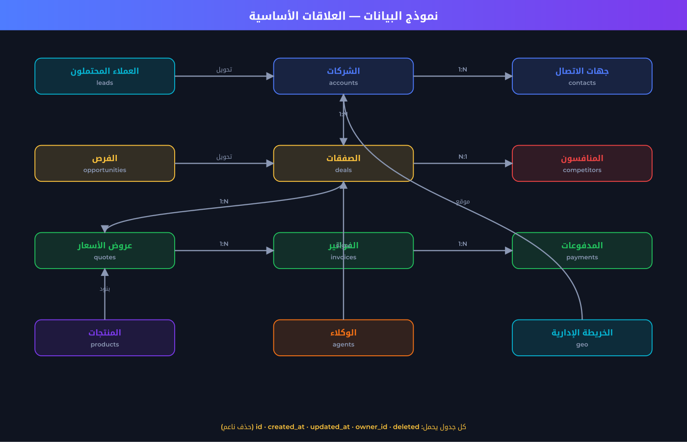
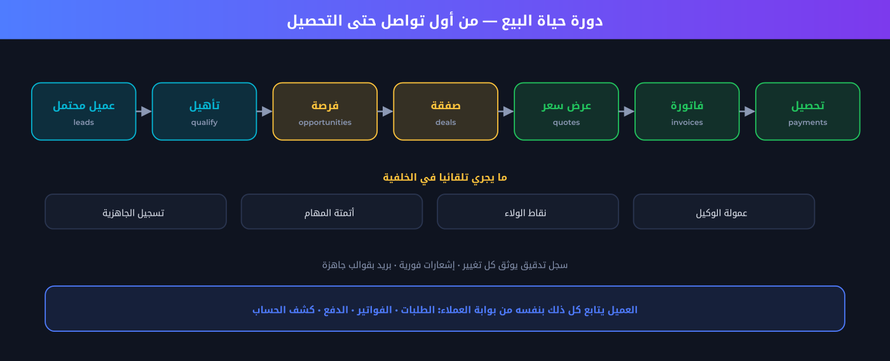
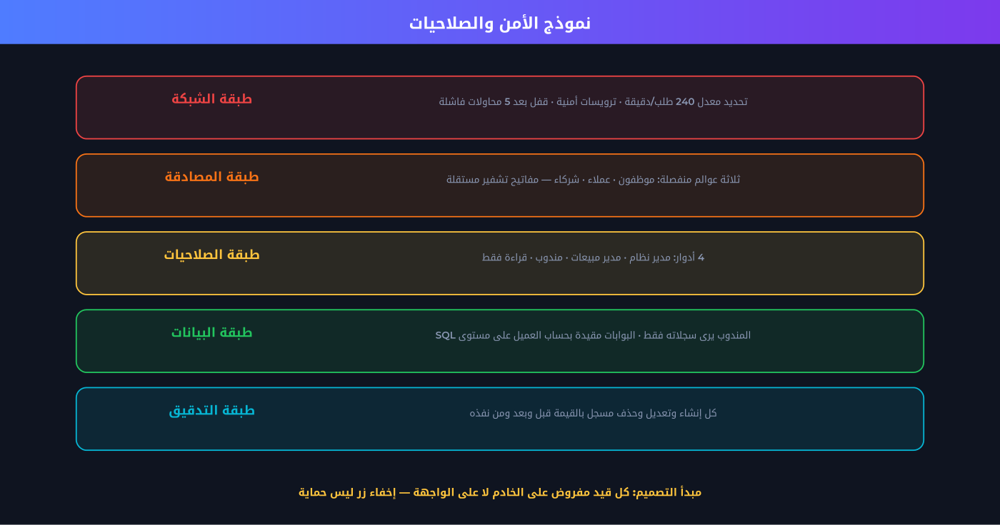
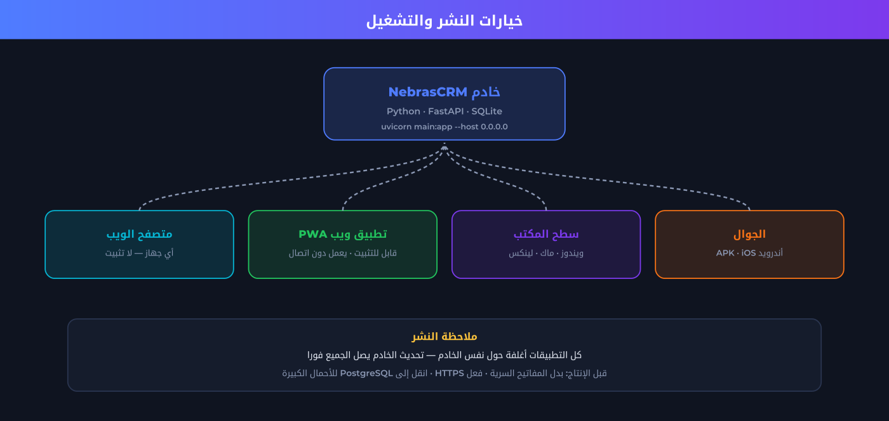

# وثيقة النظام — NebrasCRM
**نِبراس سي آر إم · منصة إدارة علاقات العملاء للمؤسسات**
الإصدار 1.0.0 · وثيقة مرجعية شاملة

---

## 1. نظرة عامة

**NebrasCRM** منصة مؤسسية متكاملة تجمع المبيعات والتسويق والدعم والمخزون والمالية في نظام واحد،
مصمَّمة للمؤسسات العالمية بتعريب أصلي كامل وذكاء اصطناعي يعمل على خادم المؤسسة نفسها.

> **النِّبراس**: المصباح الذي يُهتدى به — ووظيفة النظام أن يضيء بيانات عملائك فتهتدي بها في قراراتك.

### أرقام النظام

| المؤشر | القيمة |
|---|---|
| وحدات البيانات | **15** |
| نقاط نهاية API | **188** |
| جداول قاعدة البيانات | **48** |
| شاشات تطبيقية | **28+** |
| تقارير جاهزة | **17** |
| قنوات الدفع | **36** |
| تكاملات خارجية | **18** |
| محركات الذكاء الاصطناعي | **7** |
| دول ومناطق ومدن عالمية | **252 / 3,865 / +235,000** |
| بوابات مستقلة | **3** |
| أسطر الكود | **~10,500** |

---

## 2. المعمارية



### المبدأ المعماري الحاكم: مدفوع بالميتاداتا

كل وحدة بيانات مُعرَّفة في `schema.py` كقاموس واحد. من هذا التعريف **تُولَّد تلقائياً**:

- جدول قاعدة البيانات (مع ترحيل تلقائي عند الإقلاع)
- نقاط الـAPI الكاملة (قراءة · إنشاء · تعديل · حذف · جماعي)
- شاشة القائمة بالأعمدة والفرز والترقيم
- نموذج الإضافة والتعديل بأنواع الحقول والتحقق
- الفلاتر المتقدمة والبحث الشامل
- الاستيراد والتصدير CSV
- خيارات منشئ التقارير واللوحات

**الأثر العملي:** إضافة وحدة كاملة (مثل «العقود») = قاموس واحد، دون سطر واجهة واحد.

### طبقات النظام

| الطبقة | المحتوى |
|---|---|
| **العرض** | واجهة SPA بلا إطار عمل — HTML/CSS/JS خالص، ثنائية اللغة RTL/LTR |
| **البوابة** | FastAPI: مصادقة · تحديد معدل · ترويسات أمنية · صلاحيات |
| **الأعمال** | 12 وحدة برمجية مستقلة |
| **البيانات** | SQLite بوضع WAL · حذف ناعم · سجل تدقيق |

### الوحدات البرمجية

| الملف | المسؤولية |
|---|---|
| `main.py` | التطبيق · المصادقة · CRUD العام · التحليلات |
| `schema.py` | تعريف الوحدات والحقول — نقطة التوسعة الأساسية |
| `db.py` | الاتصال · إنشاء وترحيل الجداول · سجل التدقيق |
| `ai.py` | 7 محركات تنبؤ قابلة للتفسير |
| `reports.py` | 17 تقريراً + إعدادات النظام |
| `payments.py` | دفتر المدفوعات · روابط الدفع · الويب هوك |
| `gateways.py` | سجل 36 قناة دفع + التحقق + الرسوم |
| `loyalty.py` | محرك الولاء للعملاء والوكلاء |
| `segments.py` | تصنيف RFM · القوائم · تقارير الرواكد |
| `partners.py` | الوكلاء · العمولات · كشف الحساب |
| `geo.py` | الخريطة الإدارية العالمية · الدول والمناطق والمدن |
| `intel.py` | ذكاء السوق · بطاقات المواجهة |
| `mailer.py` | القوالب · صندوق الصادر · SMTP |
| `platform_ext.py` | رؤية 360° · الحقول المخصصة · API عام |
| `portal.py` / `agentportal.py` | بوابتا العملاء والشركاء |

---

## 3. نموذج البيانات



كل جدول يحمل حقولاً قياسية: `id` · `created_at` · `updated_at` · `owner_id` · `deleted` · `created_by`.

**الحذف ناعم دائماً** — السجل يُخفى ولا يُمحى، فيبقى قابلاً للاسترجاع والتدقيق القانوني.

### الوحدات الخمس عشرة

| المجموعة | الوحدات |
|---|---|
| **المبيعات** | العملاء المحتملون · الشركات · جهات الاتصال · الفرص · الصفقات · الأنشطة |
| **التسويق** | الحملات |
| **الدعم** | تذاكر الدعم |
| **المخزون والمالية** | المنتجات · عروض الأسعار · الفواتير · الموردون |
| **ذكاء السوق** | المنافسون · منتجات المنافسين · دراسات السوق |

---

## 4. دورة حياة البيع



المسار الكامل: **عميل محتمل ← تأهيل ← فرصة ← صفقة ← عرض سعر ← فاتورة ← تحصيل**

يعمل في الخلفية تلقائياً: تسجيل جاهزية العميل بالذكاء الاصطناعي · قواعد الأتمتة ·
احتساب نقاط الولاء · احتساب عمولة الوكيل · سجل التدقيق · الإشعارات والبريد.

---

## 5. الأمن والصلاحيات



### مبدأ التصميم
> كل قيد مفروض على **الخادم** لا على الواجهة — إخفاء زر ليس حماية.

### ثلاثة عوالم مصادقة معزولة

| العالَم | المفتاح | النطاق |
|---|---|---|
| الموظفون | `SECRET` | النظام الكامل بحسب الدور |
| العملاء | `PSECRET` | بيانات شركته فقط — مقيّد على مستوى SQL |
| الشركاء | `ASECRET` | محفظته فقط — لا يرى عملاء غيره |

**مُختبر:** رمز الوكيل على واجهة الموظفين ← 401 · رمز العميل على بوابة الشركاء ← 401.

### الأدوار الأربعة

| الدور | الصلاحية |
|---|---|
| مدير النظام | كل شيء + الإعدادات + المستخدمون + الحقول المخصصة |
| مدير مبيعات | كل البيانات والتقارير — لا يعدّل إعدادات النظام |
| مندوب | **سجلاته فقط** (البيانات المشتركة كالمنتجات متاحة للجميع) |
| قراءة فقط | اطلاع كامل بلا تعديل — محمي على الخادم |

### طبقات الحماية
- تحديد معدل 240 طلب/دقيقة لكل عنوان
- **قفل الحساب بعد 5 محاولات دخول فاشلة** لمدة 15 دقيقة
- ترويسات: `X-Content-Type-Options` · `X-Frame-Options` · `Referrer-Policy` · `Permissions-Policy`
- سجل تدقيق يوثّق كل تغيير بالقيمة **قبل وبعد** ومَن نفّذه ومتى
- كلمات المرور لا تُرسل للمتصفح إطلاقاً

---

## 6. النشر والتشغيل



```bash
cd crm
python3 -m uvicorn main:app --host 0.0.0.0 --port 8008
# أول مرة فقط:
python3 seed.py && python3 seed_intel.py && python3 seed_extra.py && python3 seed_geo.py
```

| المسار | الوجهة |
|---|---|
| `/` | صفحة الهبوط التعريفية |
| `/app` | تطبيق الموظفين |
| `/portal` | بوابة العملاء |
| `/agent` | بوابة الشركاء |
| `/pay/{token}` | صفحة الدفع المستضافة |
| `/docs` | توثيق API تفاعلي (Swagger) |

### حسابات الدخول التجريبية

| الدور | البريد | كلمة المرور |
|---|---|---|
| مدير النظام | `admin@nebrascrm.io` | `admin123` |
| مدير مبيعات | `manager@nebrascrm.io` | `manager123` |
| مندوب | `sara@nebrascrm.io` | `sara123` |
| قراءة فقط | `viewer@nebrascrm.io` | `viewer123` |
| عميل (بوابة) | `ahmed.saleh@example.com` | `portal123` |
| شريك (بوابة) | `agent0@partners.ye` | `agent123` |

---

## 7. قائمة التحقق قبل الإنتاج

- [ ] تغيير المفاتيح السرية: `SECRET` · `PSECRET` · `ASECRET` · `WEBHOOK_SECRET`
- [ ] تفعيل HTTPS خلف بروكسي عكسي (nginx / Caddy)
- [ ] استبدال تجزئة كلمات المرور بـ bcrypt أو argon2
- [ ] الانتقال إلى PostgreSQL للأحمال المتزامنة العالية
- [ ] استبدال مزوّد الدفع الوهمي بمزوّد حقيقي **مستضاف** (تفادياً لنطاق PCI)
- [ ] إعداد نسخ احتياطي دوري لقاعدة البيانات
- [ ] إنشاء مفتاح توقيع خاص لتطبيق أندرويد وحفظه بعيداً عن المستودع
- [ ] ضبط `base_url` في الإعدادات ليعمل الدفع والبريد بروابط صحيحة
